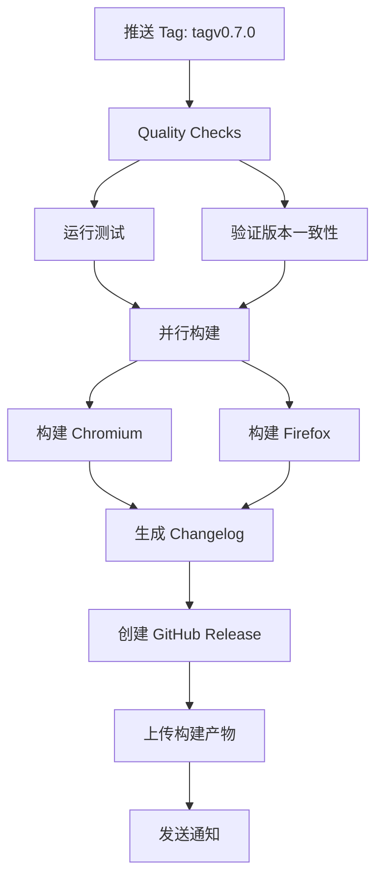
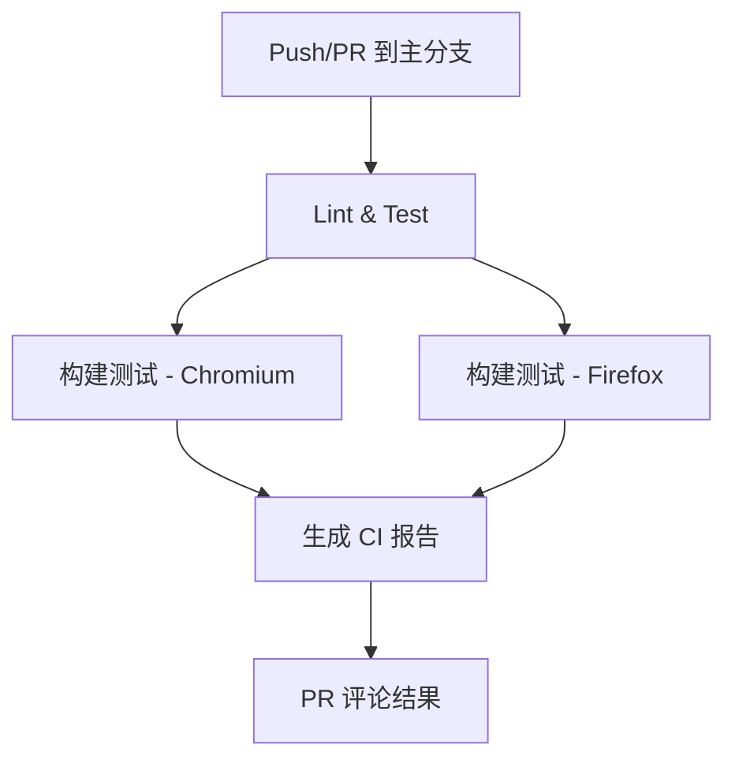

# GitHub Actions 配置文档

本项目配置了完整的 CI/CD 流程，包括自动化测试、构建和发布。

## 📦 工作流概览

### 1. **Release 发布流程** (`release.yml`)
- **触发条件**: 推送 `tagv*.*.*` 格式的标签（如 `tagv0.7.0`）
- **功能**:
  - ✅ 运行测试套件
  - ✅ 验证版本一致性（package.json 和 manifest.json）
  - ✅ 构建 Chromium 和 Firefox 两个版本
  - ✅ 自动生成 Changelog
  - ✅ 创建 GitHub Release
  - ✅ 上传构建产物（ZIP 文件）

### 2. **版本更新助手** (`version-bump.yml`)
- **触发条件**: 手动触发（workflow_dispatch）
- **功能**:
  - 自动更新 package.json 和 manifest.json 版本号
  - 创建版本提交和对应的 tag
  - 自动触发 Release 工作流

### 3. **持续集成** (`ci.yml`)
- **触发条件**:
  - Push 到 master/main/develop 分支
  - Pull Request
  - 手动触发
- **功能**:
  - 运行测试
  - 检查版本一致性
  - 构建验证（Chromium 和 Firefox）
  - PR 自动评论构建结果

---

## 🔧 初次配置

### 步骤 1: 配置 GitHub Secrets（可选）

**好消息**：GitHub Actions 已配置自动生成随机占位符，**不配置 Secrets 也能正常打包**！

如果你需要发布到 Chrome Web Store 或 Firefox AMO，才需要配置真实的 Secrets：

1. 访问仓库的 **Settings** → **Secrets and variables** → **Actions**
2. 点击 **New repository secret** 添加以下变量：

| Secret 名称 | 说明 | 是否必需 | 示例值 |
|------------|------|---------|--------|
| `MX_CHROMIUM_ID` | Chromium 扩展的公钥 | ⚠️ 正式发布必需 | `MIIBIjANB...` |
| `MX_FIREFOX_ID` | Firefox 扩展 ID | ⚠️ 正式发布必需 | `{12345678-1234-1234-1234-123456789012}` |
| `MX_CHROMIUM_UPDATE_URL` | Chromium 更新清单 URL | ⚪ 可选 | `https://example.com/updates.xml` |

> **⚡ 自动占位符功能**:
> - **未配置 Secrets**: 自动生成随机占位符，可正常打包测试
> - **已配置 Secrets**: 使用真实值，用于正式发布
>
> 这意味着你可以**立即开始使用**，无需任何配置！

#### 如何获取这些值？

**MX_CHROMIUM_ID (Chromium 公钥)**:
- 方法 1: 本地开发时从 Chrome 扩展页面获取
- 方法 2: 如果有 `.env` 文件，可从中复制

**MX_FIREFOX_ID (Firefox 扩展 ID)**:
- 方法 1: 使用 AMO (addons.mozilla.org) 生成
- 方法 2: 自定义格式如 `{12345678-1234-1234-1234-123456789012}`

**MX_CHROMIUM_UPDATE_URL**:
- 自托管更新清单的 URL
- 如不需要自动更新功能，可留空

### 步骤 2: 确认本地 .env 文件（可选）

在项目根目录创建 `.env` 文件（已在 .gitignore 中）：

```bash
# Chromium 配置
MX_CHROMIUM_ID=your_chromium_public_key_here
MX_CHROMIUM_UPDATE_URL=https://your-domain.com/updates.xml

# Firefox 配置
MX_FIREFOX_ID={your-firefox-extension-id}
```

---

## 🚀 使用方法

### 方式 1: 手动创建 Tag（推荐）

```bash
# 1. 确保代码已提交
git add .
git commit -m "feat: your changes"

# 2. 手动更新版本号
# 编辑 package.json 和 src/manifest.json，更新 version 字段

# 3. 提交版本更新
git add package.json src/manifest.json
git commit -m "chore(release): bump version to 0.7.1"

# 4. 创建并推送 tag
git tag tagv0.7.1
git push origin tagv0.7.1

# ✅ Release workflow 会自动触发！
```

### 方式 2: 使用版本更新助手（自动化）

1. 访问 GitHub 仓库的 **Actions** 标签
2. 选择 **Version Bump (Optional)** workflow
3. 点击 **Run workflow**
4. 选择版本更新类型：
   - `patch`: 0.7.0 → 0.7.1
   - `minor`: 0.7.0 → 0.8.0
   - `major`: 0.7.0 → 1.0.0
   - `custom`: 输入自定义版本号
5. 点击 **Run workflow** 确认

✅ Workflow 会自动：
- 更新 package.json 和 manifest.json
- 创建提交和 tag
- 触发 Release workflow

---

## 📋 Release Checklist

发布新版本前的检查清单：

- [ ] 所有测试通过 (`npm test`)
- [ ] 本地构建成功 (`npm run build-all`)
- [ ] package.json 和 manifest.json 版本号一致
- [ ] CHANGELOG 或提交记录清晰
- [ ] 已配置 GitHub Secrets（如需要）
- [ ] 已推送所有代码到 GitHub

---

## 🔍 工作流详细说明

### Release 工作流执行流程



### CI 工作流执行流程



---

## 🛠️ 故障排查

### 问题 1: Release 失败 - "PLATFORM_ID is empty"

**原因**: 未配置 GitHub Secrets

**解决方案**:
1. 检查 Secrets 是否已配置
2. 确认 Secret 名称拼写正确
3. 如果只是测试，可以修改 `.env` 文件并提交

### 问题 2: 版本号不一致错误

**原因**: package.json 和 manifest.json 版本不同步

**解决方案**:
```bash
# 手动同步版本号
node -e "
  const pkg = require('./package.json');
  const fs = require('fs');
  const manifest = require('./src/manifest.json');
  manifest.version = pkg.version;
  fs.writeFileSync('./src/manifest.json', JSON.stringify(manifest, null, 2) + '\n');
"
```

### 问题 3: Tag 格式不正确

**原因**: Tag 必须符合 `tagv*.*.*` 格式

**解决方案**:
```bash
# ✅ 正确格式
git tag tagv0.7.0
git tag tagv1.0.0

# ❌ 错误格式
git tag v0.7.0    # 缺少 'tag' 前缀
git tag 0.7.0     # 缺少 'tagv' 前缀
```

### 问题 4: 构建产物未上传

**原因**: 构建可能失败或文件路径错误

**解决方案**:
1. 检查 Actions 日志中的 "Build Extension" job
2. 确认 ZIP 文件是否生成
3. 验证文件路径是否正确

---

## 📊 监控和维护

### 查看 Release 状态

1. 访问仓库的 **Actions** 标签
2. 查看最近的 workflow 运行
3. 点击查看详细日志

### 下载构建产物

- **从 Release 页面**: `https://github.com/your-username/your-repo/releases`
- **从 Actions 页面**: Actions → 选择运行 → Artifacts

---

## 🔗 相关链接

- [GitHub Actions 文档](https://docs.github.com/en/actions)
- [Semantic Versioning](https://semver.org/)
- [Chrome Extension Development](https://developer.chrome.com/docs/extensions/)
- [Firefox Extension Development](https://developer.mozilla.org/en-US/docs/Mozilla/Add-ons/WebExtensions)

---

## 📝 维护日志

| 日期 | 版本 | 变更说明 |
|------|------|---------|
| 2025-12-09 | 1.0.0 | 初始化 CI/CD 配置 |

---

**需要帮助？** 请在 GitHub Issues 中提问！
